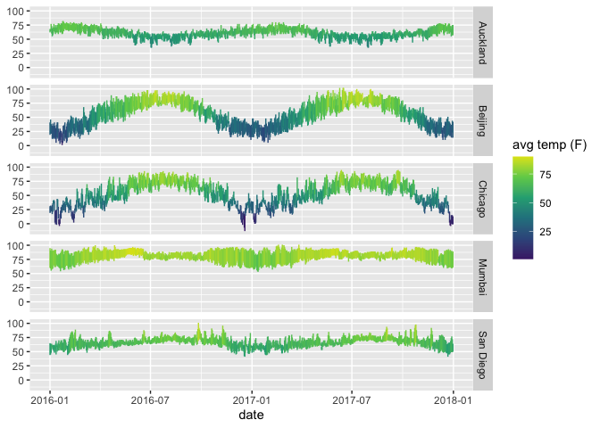

<!-- README.md is generated from README.Rmd. Please edit that file -->

# mosaicData

<!-- badges: start -->

<!-- badges: end -->

mosaicData provides a number of data sets associated with Proejct
MOSAiC.

## Installation

You can install the released version of mosaicData from
[CRAN](https://CRAN.R-project.org) with:

``` r
install.packages("mosaicData")
```

And the development version from [GitHub](https://github.com/) with:

``` r
# install.packages("devtools")
devtools::install_github("ProjectMOSAIC/mosaicData")
```

## Example

This is a basic example which shows you how to solve a common problem:

``` r
library(mosaicData)
suppressPackageStartupMessages(library(ggformula))
head(Weather)
#> # A tibble: 6 x 25
#>   city  date        year month   day high_temp avg_temp low_temp high_dewpt
#>   <chr> <date>     <dbl> <int> <dbl>     <dbl>    <dbl>    <dbl>      <dbl>
#> 1 Auck… 2016-01-01  2016     1     1        68       65       62         64
#> 2 Auck… 2016-01-02  2016     1     2        68       66       64         64
#> 3 Auck… 2016-01-03  2016     1     3        77       72       66         70
#> 4 Auck… 2016-01-04  2016     1     4        73       66       60         66
#> 5 Auck… 2016-01-05  2016     1     5        69       62       55         55
#> 6 Auck… 2016-01-06  2016     1     6        69       63       57         54
#> # … with 16 more variables: avg_dewpt <dbl>, low_dewpt <dbl>,
#> #   high_humidity <dbl>, avg_humidity <dbl>, low_humidity <dbl>,
#> #   high_hg <dbl>, avg_hg <dbl>, low_hg <dbl>, high_vis <dbl>,
#> #   avg_vis <dbl>, low_vis <dbl>, high_wind <dbl>, avg_wind <dbl>,
#> #   low_wind <dbl>, precip <chr>, events <chr>
gf_linerange(high_temp + low_temp ~ date | city ~ ., color = ~avg_temp, data = Weather) |>
  gf_refine(scale_color_viridis_c(option = "D", end = 0.95, begin = 0.1))
```


